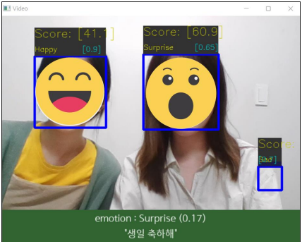

# 2022 OUTTA AI Bootcamp final project

이 프로젝트는 2022 제 1회 OUTTA AI 부트캠프의 최종 팀 프로젝트를 위한 스켈레톤 코드입니다. 
 
이 프로젝트는 자신이 연기하고 싶은 일상생활 속의 한 마디나 영화 대사 등을 입력하고, 웹캠을 바라보며 표정 연기를 하면 표정 연기의 점수를 화면에 출력하는 프로젝트입니다. 
 
이 프로젝트는 Pytorch와 

이 프로젝트에 대한 자세한 가이드라인 및 평가 기준은 업로드되어 있는 3개의 pdf 파일들을 참고하시길 바랍니다. 
 
이 프로젝트는 Google Colab 환경과 Anaconda 환경에서 시행되는 것을 기본으로 하여 제작되었습니다. 
 
